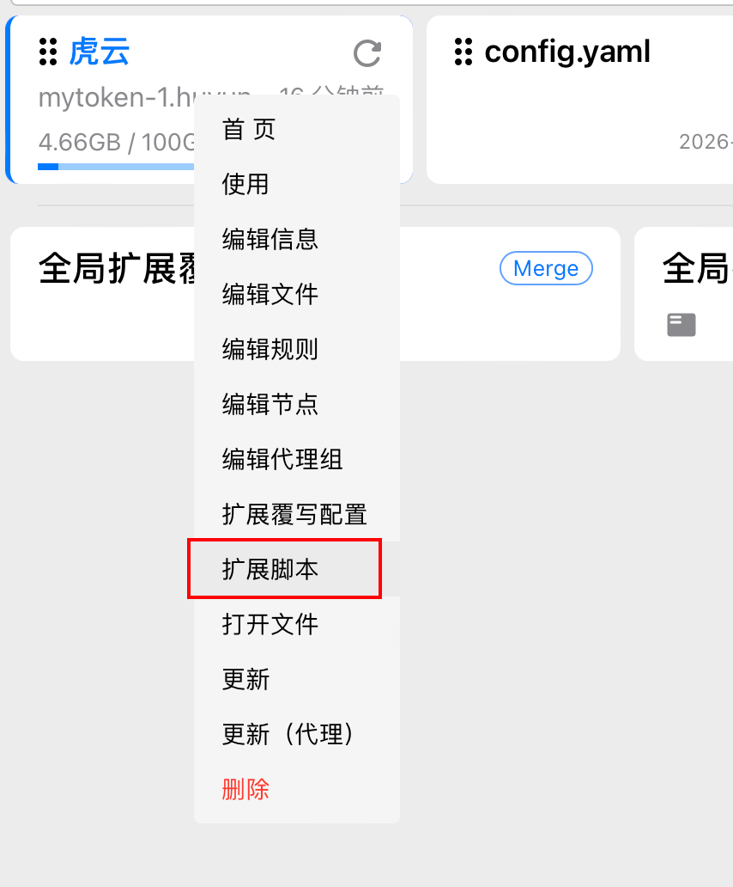

# Clash Verge 链式代理配置脚本

自动为 Clash Verge 订阅添加静态IP链式代理配置，实现固定出口IP。

## 功能特性

- ✅ 订阅更新后自动生效，配置不丢失
- ✅ 自动测速选择最快的机场节点作为入口
- ✅ 固定出口IP，适合需要白名单的场景
- ✅ 支持自定义配置，适配不同代理协议

## 工作原理

### 流量路径

```
你的设备 
  ↓
🔗 静态IP链式 (最终) [手动选择组]
  ↓
🇺🇸 静态IP节点 [dialer-proxy: 自动优选]
  ↓
⚡️ 自动优选 (入口) [url-test自动测速]
  ↓
🇸🇬 新加坡节点 [最快的机场节点]
  ↓
目标网站 (看到的IP是静态IP)
```

### 核心机制

1. **dialer-proxy**：Clash 的链式代理功能，指定节点通过哪个代理连接
2. **url-test**：自动测速类型，每300秒测速一次，选择延迟最低的节点
3. **脚本自动执行**：Clash Verge 在订阅更新后自动执行脚本，动态修改配置

## 使用方法

### 1. 配置脚本

编辑 `clash-verge-chain-proxy.js`，修改配置区域：

```javascript
const staticProxyName = '🇺🇸 静态IP-洛杉矶'  // 节点名称
const staticProxyConfig = {
  type: 'socks5',           // 协议类型
  server: 'YOUR_IP_HERE',   // 静态IP地址
  port: 443,                // 端口
  username: 'YOUR_USERNAME_HERE',  // 用户名
  password: 'YOUR_PASSWORD_HERE',  // 密码
  udp: true                 // 是否启用UDP
}
```

**支持的协议类型：**
- `socks5` - SOCKS5 代理
- `http` - HTTP/HTTPS 代理
- `ss` - Shadowsocks
- `trojan` - Trojan
- 其他 Clash 支持的协议

### 2. 导入到 Clash Verge

#### 方法一：通过界面导入（推荐）

1. 打开 Clash Verge
2. 在订阅列表中，**右键点击**你的订阅
3. 选择「**扩展脚本**」

   

4. 将 `clash-verge-chain-proxy.js` 的内容粘贴到脚本编辑器中
5. 保存并更新订阅

#### 方法二：直接复制文件

```bash
# macOS
cp clash-verge-chain-proxy.js ~/Library/Application\ Support/io.github.clash-verge-rev.clash-verge-rev/profiles/YOUR_SCRIPT_ID.js

# Windows
copy clash-verge-chain-proxy.js %APPDATA%\io.github.clash-verge-rev.clash-verge-rev\profiles\YOUR_SCRIPT_ID.js

# Linux
cp clash-verge-chain-proxy.js ~/.config/io.github.clash-verge-rev.clash-verge-rev/profiles/YOUR_SCRIPT_ID.js
```

### 3. 更新订阅

在 Clash Verge 中更新订阅，脚本会自动执行。

### 4. 选择链式代理

在主界面选择策略组（如「虎云」），然后选择 `🔗 静态IP链式 (最终)`。

## 验证出口IP

访问以下网站验证出口IP：

```bash
curl ifconfig.me
# 或
curl ip.sb
# 或访问
https://ifconfig.me
```

应该显示你配置的静态IP地址。

## 自定义配置

### 修改自动优选参数

```javascript
{
  name: autoSelectGroupName,
  type: 'url-test',
  url: 'http://www.gstatic.com/generate_204',
  interval: 300,    // 测速间隔（秒）
  tolerance: 50,    // 延迟容差（毫秒），差值小于此值不切换
  proxies: airportNodes
}
```

### 修改目标策略组

```javascript
const targetGroups = ['虎云', 'bing、onedrive', 'steam', 'pikpak']
// 添加或删除需要包含链式代理选项的策略组
```

### 过滤机场节点

```javascript
const airportNodes = config.proxies.filter(p =>
  !p.name.includes('🐯') &&      // 排除包含🐯的节点
  !p.name.includes('使用') &&    // 排除提示节点
  !p.name.includes('联系') &&
  p.name !== staticProxyName
).map(p => p.name)
```

## 使用场景

1. **需要固定IP白名单**
   - API 服务需要IP白名单
   - 企业VPN需要固定出口IP
   - 游戏加速需要稳定IP

2. **提高连接稳定性**
   - 通过优质机场线路连接静态IP
   - 避免直连静态IP速度慢或不稳定

3. **隐藏真实IP**
   - 真实IP不直接连接静态IP
   - 通过机场节点中转

## 常见问题

### Q: 为什么要用链式代理？

A: 直接使用静态IP可能速度慢或不稳定，通过机场节点的优化线路连接静态IP，可以提高速度和稳定性。

### Q: 出口IP是哪个？

A: 出口IP是你配置的静态IP，目标网站看到的是静态IP地址。

### Q: 订阅更新后配置会丢失吗？

A: 不会。脚本在每次订阅更新后自动执行，重新添加配置。

### Q: 如何禁用链式代理？

A: 在策略组中选择其他节点即可，不影响原有节点使用。

### Q: 支持哪些代理协议？

A: 支持 Clash 的所有代理协议：socks5、http、ss、ssr、vmess、trojan、snell 等。

## 技术细节

### dialer-proxy 工作原理

```javascript
{
  name: '静态IP节点',
  type: 'socks5',
  server: 'static-ip.example.com',
  port: 443,
  'dialer-proxy': '入口节点'  // 关键配置
}
```

当访问目标网站时：
1. Clash 先连接「入口节点」
2. 通过「入口节点」连接「静态IP节点」
3. 通过「静态IP节点」访问目标网站

### url-test 自动测速

- 每隔 `interval` 秒向 `url` 发送请求
- 记录每个节点的延迟
- 选择延迟最低的节点
- 如果当前节点与最快节点延迟差小于 `tolerance`，不切换（避免频繁切换）

## 许可证

MIT License

## 贡献

欢迎提交 Issue 和 Pull Request！

## 相关链接

- [Clash Verge Rev](https://github.com/clash-verge-rev/clash-verge-rev)
- [Clash Meta 文档](https://wiki.metacubex.one/)
- [Clash 配置文档](https://dreamacro.github.io/clash/)
